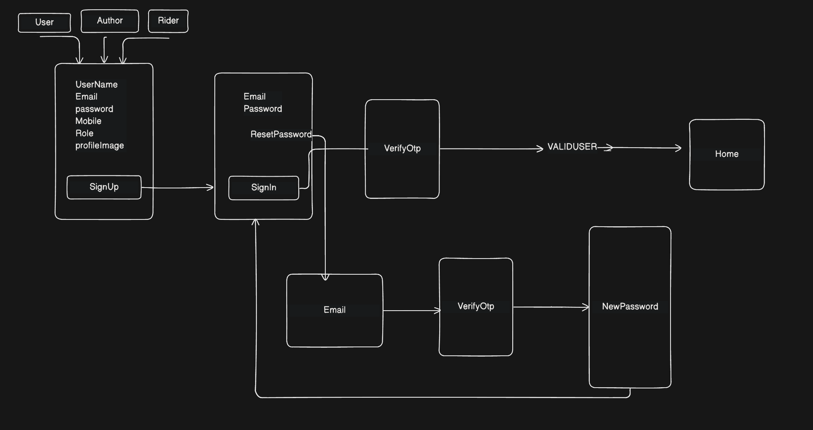

# 🔐 MERN Authentication System (Complete Production Flow)

<br>

A complete production-ready Authentication System built using:

- Node.js
- Express.js
- MongoDB
- React (Vite)
- JWT
- HTTP-only Cookies
- OTP Verification
- Refresh Token Rotation 

This project demonstrates a real-world authentication architecture including secure login, OTP verification, refresh token management, and password reset system.


# Frontend Picture 


### Rolebase SignUp


**SignIn**

### Rolebase SignIn


**FORGETPASSWORD**

### Forget Password & OTP UI


#  Features

### 👤 User Authentication
- User Registration
- Secure Login
- Password Hashing (bcrypt)
- Role-based structure
- Cookie-based Authentication 


### 🔐 Token System
- Access Token (Short-lived)
- Refresh Token (Stored in DB)
- Refresh Token Rotation
- Max 5 active refresh tokens per user
- Logout from specific device
- Logout from all devices on password reset 


### 📧 OTP System
- Email OTP verification
- OTP expiration (5 minutes)
- Resend OTP
- Prevent OTP reuse


### 🔒 Security
- HTTP-only Cookies
- JWT verification
- Password hashing
- Token expiration
- Device-based logout
- Full token wipe on password reset

---

#  Project Architecture

##### AuthenticationFlow 

```pgsql

root
├─ backend
│  ├─ src
│  │  ├─ config
│  │  │  └─ db.js                     # MongoDB connection setup
│  │  │
│  │  ├─ controllers
│  │  │  └─ auth.controllers.js       # Registration, Login, OTP, ResetPassword
│  │  │
│  │  ├─ models
│  │  │  └─ User.models.js            # User Schema (Password, OTP, Tokens)
│  │  │
│  │  ├─ routes
│  │  │  └─ auth.routes.js            # Authentication routes
│  │  │
│  │  ├─ middleware
│  │  │  └─ auth.middleware.js        # Token verification middleware
│  │  │
│  │  ├─ services
│  │  │  ├─ sendMail.services.js      # Nodemailer OTP sender
│  │  │  └─ token.services.js         # Access & Refresh token logic
│  │  │
│  │  ├─ utils
│  │  │  └─ generateOtp.js            # OTP generator helper
│  │  │
│  │  └─ app.js                       # Express app configuration
│  │
│  └─ server.js                       # Entry point
│
└─ frontend
   ├─ src
   │  ├─ pages
   │  │  ├─ SignUp.jsx
   │  │  ├─ SignIn.jsx
   │  │  ├─ ForgotPassword.jsx
   │  │  ├─ VerifyOtp.jsx
   │  │  └─ ResetPassword.jsx
   │  │
   │  ├─ services
   │  │  └─ api.js                    # Axios config (withCredentials: true)
   │  │
   │  ├─ App.jsx                      # Route configuration
   │  ├─ main.jsx                     # React entry point
   │  └─ index.css
   │
   └─ package.json

```

## Api Endpoint 


---

## 📌 Endpoints Table

| Method | Endpoint          | Description                               |API                               | 
|--------|-----------------|--------------------------------------------|----------------------------------|
| POST   | `/Registration` | Register a new user and send OTP           |http://localhost:3000/api/auth/users/Registration|
| POST   | `/Login`        | Authenticate user and generate tokens      |http://localhost:3000/api/auth/users/Login|
| POST   | `/VerifyOtp`    | Verify OTP to activate account             |http://localhost:3000/api/auth/users/VerifyOtp|
| POST   | `/ResendOtp`    | Resend OTP to user's email                 |http://localhost:3000/api/auth/users/ResendOtp
| POST   | `/SignOut`      | Logout user and clear authentication tokens|http://localhost:3000/api/auth/users/SignOut
| PUT    | `/ResetPassword`| Reset password (Requires valid AccessToken)|http://localhost:3000/api/auth/users/ResetPassword|

---


# 🔄 Authentication Flow Diagram

Registration →
Hash Password →
Generate Tokens →
Save Refresh Token →
Set HTTP-only Cookies

Login →
Verify Password →
Generate Tokens →
Generate OTP →
Send Email →
Save OTP

Verify OTP →
Match OTP →
Check Expiry →
Activate Account

Reset Password →
Verify OTP →
Hash New Password →
Clear All Refresh Tokens →
Force Re-login




🔑 Token Architecture
### Access Token
- Short expiry
- Stored in HTTP-only cookie

### Refresh Token
- Long expiry
- Stored in database
- Max 5 active tokens

Removed on logout

```js
$push: {
   RefreshToken: {
      $each: [{ token }],
      $slice: -5
   }
}
```

# 🔐 Security Implementation

- Password hashed using bcrypt
- Tokens stored in HTTP-only cookies
- Refresh token stored in database
- OTP expiration system
- Device-specific logout
- All devices logout on password reset
- Environment variables protected


# Backend Setup

```js
npm install express mongoose cors jsonwebtoken cookie-parser nodemailer bcrypt multer @imagekit/nodejs express-validator
```
```js
npm i --save-dev nodemon
```

## Run Server 

```js
npm run dev
```


## Frontend Setup

1. Install Dependencies

```js
npm install react-router-dom axios tailwindcss daisyui motion
```

2. Run Frontend
```js
npm run dev
```

### 🔑 Environment Variables (.env)

```js
PORT=8000
MONGOOSE_URI=
ACCESS_TOKEN_SECRET_KEY=
REFRESH_TOKEN_SECRET_KEY=
ACCESS_TOKEN_TIME=
REFRESH_TOKEN_TIME=
ACCESS_TOKE_MAXAGE=
REFRESH_TOKEN_MAXAGE=
SaltNumber=

EMAIL_USER=
CLIENT_ID=
CLIENT_SECRET=
REFRESH_TOKEN=

PRIVATE_KEY_IMAGEKIT=
```

## What I Learned

- Complete authentication lifecycle
- Token-based security architecture
- OTP verification logic
- Refresh token rotation
- Cookie-based authentication
- Production-ready backend structure
- Handling common authentication bugs

## Future Improvements

- Role-based authorization (Admin/User)
- Email verification link
- Google OAuth login
- Rate limiting

# Author
Built with  by **Songram Modak** 
